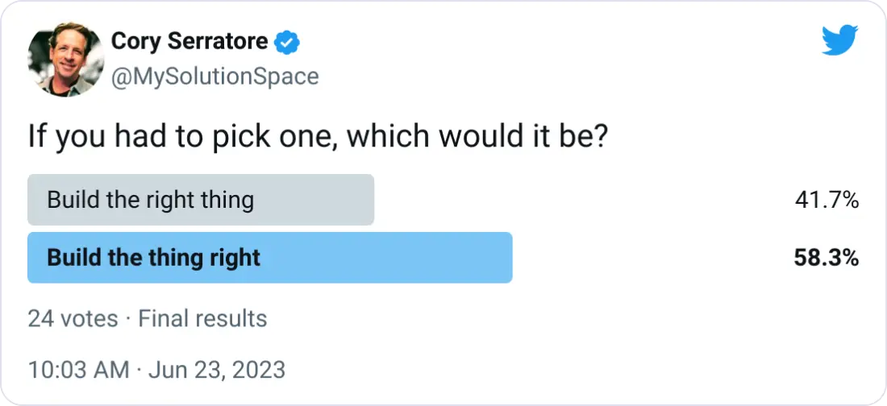
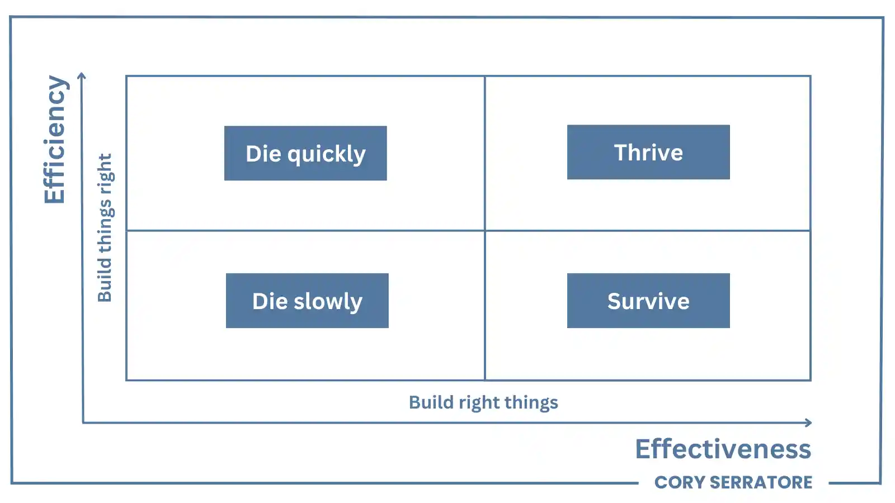

# Build The Right Thing

## Feeding the Sharks

Strategy. Tactics.

What's the difference between them? Is one more important than the other?

There's a scene in the movie Rounders that immediately came to mind...

A group of professional poker players are sitting at a table at the Mirage in Vegas, honing their skills. They're trading jokes as well as the occasional dig at each other while passing the time.

A couple of tourists in town for a good time figure they'd give poker a try and sit at the table.

They have no idea they've walked into a shark tank.

Matt Damon narrates:

"After all, how different could it be from the home games they've play their whole lives? All the luck in the world isn't gonna change things for these guys. They're simply overmatched. We're not playing together but, then again, we're not playing against each other, either. It's like the Nature Channel. You don't see piranhas eating each other, do you?"

The scene continues with a montage of tourists offering themselves up as prey to the sharks.

We've all been there.

Outclassed. Outmaneuvered.

Beaten by competitors who seems to operate at another level.

The loss stings.

Having your defeat handed to you with so little effort on their is what hurts the most.

How does this happen?

The same way it did for the tourists in the story above. They faced off against opponents who were superior in both strategy and tactics. 

The odds were not only stacked against them. They were _multiplied_ several times over.

## The Mediocrity Trap

"This doesn't apply to me", you're thinking. You've got knowledge, skills, a strong work ethic, experience.

You're doing everything - as much, if not more, than everyone else. But it's never enough to stand out and get noticed, attract more clients, find success and make more money.

You're a product owner. You have a good rapport with your clients. You do your due diligence, your reach out and you're empathetic to their problems. You use their feedback to inform a backlog based on  common problems you can help solve.

But progress is slow. Features seem to always take longer than they should. Meanwhile, your competition are making bold moves and challenging your market position.

You don't understand why you're struggling to keep pace.

You're a software developer. You feel stuck on an endless technology treadmill. You've got a passion for learning. All that stands in your way is mastering this latest technology or design pattern.

But the features keep coming in. The requirements seem to be all over the map, from one area of the product to another. There's so much breadth and depth to cover. Nobody on your team has a complete handle on everything.

There are dark corners of your software that nobody feels confident in changing. The tech backlog is daunting.

You're a CTO. You oversee the technology strategy of your organisation. You drive innovation. You manage technical teams. You align technology initiatives with the company's vision and goals.

But there in't a clear alignment between business objectives and technology initiatives. To make matters worse, shiny object syndrome pervades the industry. Every six months, it seems there's another cycle towards one trend to another.

You're a business owner and creator. You're struggling to define your brand. Niche down, some say. Others tell you to generalize and that "you are the brand". You struggle to convey your value proposition and the focus of your content.

There's so much conflicting advice:

"Just put something out there and see what sticks, and double down on that.".

"Find a problem, solve a problem."

Talk of pillars, values, mastery... it's all so confusing. 

But you keep posting content because consistency matters more than anything.

Until one day you stop, because you're burned out and aren't seeing progress.

Meanwhile, creators all around you are posting 0-1k, 5k, 10k follower growth. They're banking three, four, five figures in revenue per month.

And every other business owner and creator seems to be ng just the right problem to solve. Their customers are eating it up. They're killing it.

## It's Not You, It's You

"OK Cory, so what the hell is going on? What am I missing?", you are no doubt asking.

Listen. It's not you.

Well, it is, but you may very well be doing everything right, if not better, than everyone else.

But you're not doing the right things.

You're relying too much on tactics, but it's your strategy - or lack of one - that is failing you.

## Strategy vs. Tactics

Strategy and tactics are two interconnected but distinct concepts. They're often used together. But they refer to different levels and aspects of planning and decision making.

A strategy is a high-level and long-term plan. It strives to create a competitive advantage and to achieve a desired outcome.

Tactics are the specific actions of the strategy. They achieve short-term objectives towards the goal.

Strategy focuses on the big picture. Tactics focus on the details of execution.

A good strategy aligned with well-executed tactics is a powerful combination.

What happens when one of these are lacking, and which is more important?

I asked my audience this very question, from the perspective of building something.

The response was divided.

Half of the respondents believe the tactics are more important to the outcome.

The other half believe the strategy - what you choose to build and why - are more important to the outcome.

I have an opinion, and another story to share.

## Being a Dope on the Ropes

The _Rumble in the Jungle_ is "arguably the greatest sporting event of the 20th century". 

The setting was Zaire, Africa in 1974. It featured Muhammad Ali against undefeated and undisputed heavyweight champion George Foreman. 

The 32 year old Ali was coming in as a well-worn 4-1 underdog. His opponent was the younger heavy-hitting Foreman. Formane was renown for his punching power, size, and sheer physical dominance.

Both fighters came into the match with a different game plan.
Foreman had been training to cut off the ring. This would negate Ali's speed advantage and force him into a battle of punching power. A winning plan, as predicted by most who believed George would come out on top.

Ali had a strategy of his own. Ali had been teasing his training staff and fans of a secret plan he had devised to counter Foreman.

The first round started as predicted, with one exception. Ali deployed his usual speed and footwork. By the end of the round, Foreman was catching up. Ali's strikes were not causing any significant damage. Meanwhile, Foreman was preventing his opponent's escape while landing punches of his own. By the end the round, both fighters had tested their opponent. Both fighters were confident in their strategy.

How this played out for the rest of the match, surprised everyone.

Correction: almost everyone. In the second round, Ali put his plan to work and changed tactics.

Ali introduced a tactic that he had named "rope-a-dope" during his sparring sessions while training for the match. He would literally "act like a dope on the ropes". Ali pretended to be trapped and lying against the ropes while his opponent attacked mercilessly.

But Ali had trained for this. Ali built up his ability to block and deflect hits, and his endurance to absorb the few that got through.

On the surface, this gave the appearance that Ali was being overwhelmed by his opponent. Many in the audience thought Ali was being badly beaten and were concerned about his well-being.

What they didn't know is that this was all by design.

Leaning on the ropes allowed Ali to absorb and deflect much of the energy behind Foreman's punches. Keeping his guard up, most of Foreman's punches were slipping or landing harmlessly against Ali's gloves and arms. They also failed to score on the judges cards.

Meanwhile, Ali was taking every opportunity to counter with straight punches to Foreman's face. Ali would lock Foreman him in clinches and lean on him with all his weight to tax his opponent's energy reserves. To top it off, Ali would taunt Foreman by mocking his punching power.
This had the intended effect of enraging Foreman. Foreman threw even harder and faster.

This went on round after round.

By the fourth, Foreman's face was beginning to show the effects of Ali's counter-punches. The tide was starting to turn from what appeared to be a lop-sided affair.

Ali had stunned his opponent on occasion with combinations. Still Foreman continued his barrage, but with decreasing impact.
By the eight round, Foreman's fatigue began to show. Both his attacking and defensive ability diminished.

Spotting the opportunity Ali was waiting for, he wasted no time in taking advantage.
Ali, was once again pinned on the ropes. But Ali had plenty of attack power still in the tank. Ali pivoted and countered with a combination of hard right and left hooks that brought Foreman down to the canvas in a stunning victory.

George Foreman entered the match as the clear favourite. He had the tactical advantage and a predictable game plan.

Yet, Muhammad Ali had devised a winning and flexible strategy. Ali not only neutralized, but countered his opponent's advantage.

The two top contenders in the world. A classic example of speed and technical skills against raw power.  An example of how strategy would be the deciding factor in the outcome.

## The Eisenhardt Matrix

Too many businesses play the game like tourists at the Mirage in Vegas.

Even those that aren't outmatched in tactics still fail to apply them effectively.

Building the right thing in the right way by combining effective strategy with efficient tactics is a recipe for success.

Here's what may surprise many of you.

> The more efficient you are at doing the wrong thing, the wronger you become.
>
> -- <cite>Dr. Russell Ackoff</cite>

In other words, building the wrong things right may actually do more harm than building the right thing wrong.

The Efficiency/Effectiveness matrix, also known as the Eisenhardt matrix, illustrates this.

Building the wrong things but building them right is actually the deadliest quadrant of the Eisenhardt matrix.

A simple example is driving an efficient vehicle in the opposite direction of your destination. You will end up further from your goal than if you walked.

I can also trace this matrix back to the story of the Rumble in the Jungle. George Foreman fought efficiently within his plan. He was able to throw an enormous volume of punches at Ali. Yet, Muhammad Ali's strategy redirected Foreman's efforts. This led Foreman to exhaustion and, eventually, defeat.

The Eisenhardt matrix applies just as well to business and, more specifically, software development.

Code ain't cash.

Software development organizations are not paid for the code they deliver, but for the problems they solve.

Software that solves customer problems is an asset.

Software that does not solve problems is a liability.

In other words, building the right thing the right way is the goal, but...

What you build - if it is effective in solving problems - is more important than how efficiently you build it.

Fortunately, there are accepted strategic design practices and patterns that help businesses build effective solutions. They also tend to have qualities that improve the ability to build solutions more efficiently.

These strategic design practices and patterns will be the subject of future installments of my Build The Right Thing email course on My Solution Space newsletter.

If you've made it this far, thank you so much for your attention. I appreciate you.

If you enjoyed this content, you will also enjoy following my Twitter content [@CorysDomain ](https://twitter.com/CorysDomain).
