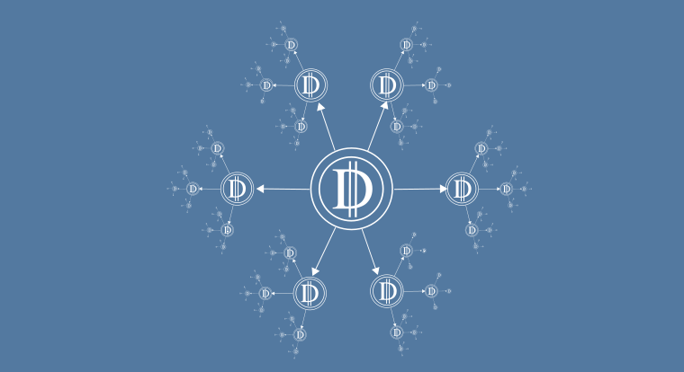

Software systems input data from the physical world (users and devices) and from other software systems, where it is transformed (filtered, edited, enriched), and output as new data to the physical world (devices and users) and to other software systems.

## The Objective Is To Maximize Value

The goal of any software system is to solve problems, by accepting input data representing a problem, processing the data to solve the problem, and providing output data representing the solution to the problem.

An objective of every software system is to generate value, in the form of data representing the solution to a problem.

Therefore, an objective of every software system is to maximize the value it generates - the return on investment (ROI) in building the software - by maximizing value it generates for each problem it solves and maximizing the number of problems it solves.

This formula,

`max(value per problem solved) x max(number of problems solved)`

is the value potential of a software system.

## Software Is A Betting Game

Software development is a relentless and unforgiving treadmill of placing high-risk bets on the ability to identify and solve client problems.

Based on a study by the Standish Group, only 11% of new application development projects reported a high return on investment (ROI).

49% of new application projects fail to provide sustainable ROI.

Statistics indicate the stakes are high and there is little margin for error.

Consider the forces behind these each bet:

- Software systems require capital investment to build.
- Software systems incur ongoing operational costs to remain online.
- Software systems must generate a positive return on investment to remain sustainable.

## How To Beat The House

How can we improve the odds of delivering a successful software application?

That's a very broad question.

I write about all sorts of strategic and tactical systems, practices, patterns and technology options related to building better software and building software better.

Most of these are focused on either improving the bets one places, or the execution on those bets.

However, there is the fundamental question of how software organizations tend to view ROI.

In many cases, they are failing to deliver their full value potential - by a large margin, possibly orders of magnitude.

A lot of this value potential, in the form of data, is left on the table or, more apt, stuffed under the mattress and forgotten about.

Our economy, in a grossly simplified form...

1. A bank accepts a deposit from a customer, say $100.
2. The bank lends that $100 to another customer, to be repaid with interest, say 10%.
3. The customer uses that $100 as investment capital to a business venture, adds value, and make a profit.
4. The customer repays the loan plus interest to the bank: $110.
5. Both the customer and the bank have generated additional value from the initial loan. This is monetary expansion.
6. Scale this up to multiple banks, customers and loans, and you have a currency-backed economy.

Data is the currency of the digital economy.

Yet, most software organizations still treat data a little more than a byproduct of behavioral features.

At best, data may be disposed of to a centralized data lake or warehouses—a metaphorical landfill—for a centralized business intelligence team to pick through.

What if we truly started treating the data of our systems as the fundamental currency of our systems?

How can we leverage data as currency to achieve the objective of realizing the value potential of a software system?

As usual, seek analogies and patterns in existing systems. In this case, the traditional currency-backed economic system.

What does this system demonstrate? The potential of **monetary expansion**.

What is the key driver of monetary expansion?

The **free exchange of money**.

Free as in based on a system and policies that facilitate a relatively unobstructed exchange of money (currency) between individuals and organizations.

So they may apply leverage and add value to the overall system.

Software systems have traditionally lacked an underlying system and policies to facilitate such a free flow of data.

Until now. Until the concept and principles of *data mesh* emerged.

### Data Mesh Principles

I'll dive deeper into the concept and principles of data mesh in other newsletters and articles. It's a rich topic.

For now, a summary of the principles are sufficient to see how it aligns with and supports the objective of monetary expansion, based on data as the currency.

The four core principles of data mesh are:

1. domain-oriented decentralized data ownership and architecture
    - the domain and system of origin is responsible for the data, it's quality, and availability
2. data as a product (currency)
    - data is the currency. Product owners should give it equal consideration as a product or feature as behavior.
3. self-serve data infrastructure as a platform
    - Just as you can easily access your money online, remotely via bank cards, or at ATMs, other software systems and teams should have convenient self service access to your data.
4. federated computational governance.
    - Interoperability through global standards, dynamic topology, discoverability, and automation in a distributed rather than centralized manner.

## The Payback

An organization that embraces data mesh principles will have a distinct advantage over their competitors.

Silos that previously impeded integration and collaboration between product teams fall.

Instead of highly coupled integrations that require high-bandwidth communication and coordination between teams, integration becomes much more passive and autonomous.

Downstream consumers can simply opt-in and tap into existing data streams and decide if and how they can leverage it to add value.

A free flow and exchange of data removes the barriers of discovery and awareness of what is available and what is possible.

Value potential that was previously buried under product teams' mattresses is now unlocked and can be realized by facilitating experimentation and innovation.

## Risks and Mitigation

Free markets thrive because they rely on a strong foundation of principles and policies. Consideration for all four data mesh principles are important to the success of a data mesh strategy.

Without domain-oriented data ownership and architecture, you risk the inefficient dependency and bureaucracy of a centralized business intelligence team. You also lose accountability for data quality and change management, impacting the quality and resilience of downstream consumers, and the value they are able to deliver.

Without a commitment to data as a product, data will continue to be treated as an afterthought and the potential of data mesh will be unrealized and the initiative runs the risk of withering on the vine.

Without a focus on a self-serve data infrastructure as a platform, frictions for sharing and consuming data may be sufficient to disincentive and de-prioritize such efforts. Again, the initiative may never gain traction.

Finally, without federated computation governance, an abundance of inefficiencies, friction, and quality issues may cause the entire data mesh initiative to collapse under its own weight. Data mesh requires some effort, commitment, and discipline. The payoff is returned in multiples.

## Related Practices, Patterns, and Technologies

The data mesh principles do not subscribe any specific practices, patterns or technologies. However, many align very well, such as

- Event driven architecture and business process choreography
- Event streaming
- Domain Driven Design
- Apache Kafka

The next time you are working on a value proposition for a product or feature, give equal consideration to the data as well as the behavior.

Remember, it's the data that results from a software system's behavior that solves a problem, and this data has the potential to enable other downstream systems to solve their problems as well.

>If you love something, let it go. If it returns, it's yours; if it doesn't it wasn't.
>—Unknown

In other words...

>Set your data free. It it has value, that value will return to you in multiples.
>—Cory Serratore

If you like this kind of thing, consider following me on Twitter, where I provide bite-size thoughts and experiences on topics I am passionate (or just curious) about, such as:

- the digital creator economy
- building scalable software systems, teams, and organizations
- life lessons and inspirations from The Beatles
